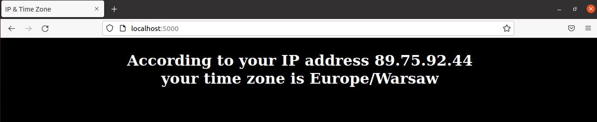

# Programowanie full stack w chmurze obliczeniowej

[Docker Hub](https://hub.docker.com/repository/docker/maciogx2/pfswco_1)

Budowanie obrazu

    docker build -t server_mr <PATH>
Uruchomienie kontenera

    docker run -d -p <Host port>:3000 --name time_server server_mr
Uzyskanie informacji z kontenera

    docker logs time_server 

Sprawdzenie ilość warstw

    docker history server_mr

